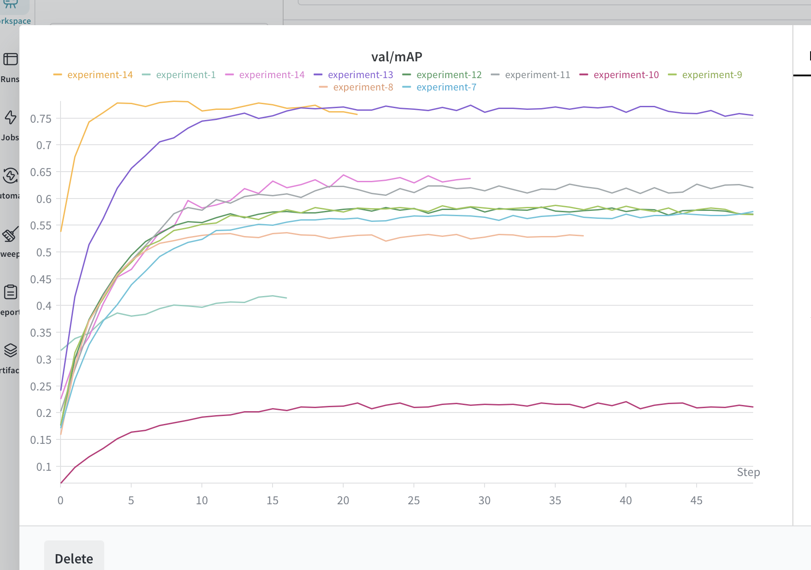

# Plant Disease Classification

Classifies plant diseases from leaf images — independent of the host plant species. Given an image, the model predicts the disease (e.g. "late blight") regardless of whether it's on a tomato or a potato.

## Dataset

~8,000 images across 38 plant species and 40 disease classes. Folders are named `[plant] [disease]` (e.g. `tomato late blight`). The model is trained to predict the disease label only.

## Project Structure

```
├── model.py                   # EfficientNet-B0 backbone + GRL + disease/domain heads
├── inference.py               # loads model from HuggingFace, runs prediction
├── api.py                     # FastAPI endpoint
├── Plant_Disease_final.ipynb  # training notebook
└── split_test.ipynb           # held-out plant evaluation
```

## Setup

```bash
pip install torch torchvision timm fastapi uvicorn pillow huggingface_hub
```

## Run the API

```bash
uvicorn api:app --reload
```

Model weights are downloaded automatically from [`withtwon/plant-disease-model`](https://huggingface.co/withtwon/plant-disease-model) on first run.

Swagger docs available at `http://localhost:8000/docs`.

## Predict

Open http://localhost:8000/docs in your browser, click POST /predict → Try it out → upload an image → Execute.

Response:
```json
{
  "predictions": [
    {"class": "black leaf streak", "prob": 0.972},
    {"class": "brown spot", "prob": 0.009}
  ]
}
```

## Experiments

Experiments are tracked on Weights & Biases under the project `Plant_Disease_Classification`. Unfortunately the public link cannot be shared as the project is under a university corporate account which does not support public visibility. Results are reported in the technical report.



## Model Weights

[`withtwon/plant-disease-model`](https://huggingface.co/withtwon/plant-disease-model/tree/main) under "best_model_2.pth"
